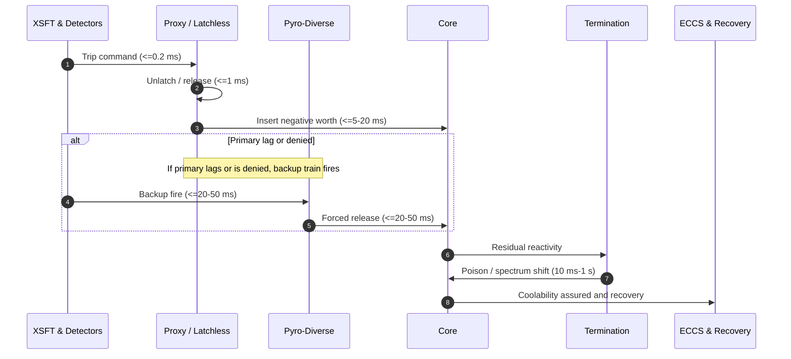

# RIA Protection Upgrade Stack — Sense → Release → Terminate → Recover

**Author:** Steven Lanier-Egu
**Credit:** SEAL Division
**Date:** December 09, 2025
**Version:** v0.7

---

## Executive Summary

This specification delivers a physics-respecting, licensable upgrade to reactivity‑initiated accident (RIA) mitigation in high‑burnup cores. The core design pattern is **Sense → Release → Terminate → Recover**:

- **Sense:** XSFT interprets dρ/dt and field curvature as **coherence shear**, fused with diverse fast channels (neutron flux rate‑of‑rise, CRDM acceleration/jerk signature (mechanical pre-trigger for ejection).
- **Release (Fast Path):** **Pre‑loaded negative worth** via latchless absorbers (gravity/spring) with ultra‑fast unlatch; **pyro‑diverse backup** guarantees drop if primary is denied.
- **Terminate (Tail):** **Soluble poison** and/or **spectrum shift** sized for the 10–1000 ms tail to crush residual reactivity and prevent recriticality.
- **Recover:** Weaver‑11 sequences ECCS posture, coolability checks, inspection, and forensics with OISF invariance/ethics gates and immutable logs.

The design aligns with prompt RIA timescales, reduces PCMI risk (paired with ATF and fuel geometry upgrades), and improves explainability, diversity, and operator workload. All requirements map to V&V artifacts.

---


*Validated by a reference simulation; see [Appendix A](#appendix-a--simulation-methods--validation).*

## Executive Overview — One Page (for briefings)

**What happens in one view:** detect fast, insert pre‑loaded worth, crush the tail, prove it in logs.

### Timeline & Actuation Trains (schematic)



### Worth vs Time (targets)
| Time after trip | Primary fast path (proxy/latchless) | Backup pyro-diverse | Termination path (poison/spectrum) |
|---|---|---|---|
| 20 ms | >= **0.5 mk** | >= **0.4 mk** | n/a |
| 50 ms | >= **1.0 mk** | >= **0.8 mk** | n/a |
| 1 s   | Maintain safe subcritical | Maintain safe subcritical | **Plant-specific**: achieves ≥ regulatory subcritical margin **and** recriticality prevention (target worth defined per core) |

*Acceptance bands:* per‑reactor‑class ±15% unless otherwise specified in the Applicability Matrix.

### Gates (OISF) & Logs
- **Gates:** V, E_safe, O, W_eff >= 0.98, κ >= 0.98, Λ_leak == 0 (pre‑actuation check, microseconds).
- **Non‑blocking invariant:** supervisory paths cannot delay proxy actuation beyond **500 µs**.
- **Forensics:** nanosecond‑synced immutable logs; SBOM recorded for all software builds.

---

## Threat Model

- **Event:** Reactivity‑Initiated Accident (RIA) in high‑burnup PWR/BWR/CANDU‑type cores; examples: control‑rod ejection (CRE), cold‑water injection (CWI), inadvertent positive reactivity insertion.
- **Primary Risk:** Early‑phase **PCMI** (pellet–clad mechanical interaction) in embrittled, high‑burnup cladding; brittle fracture before meaningful thermal moderation occurs.
- **Design Goal:** Insert effective negative reactivity **within <= 1–5 ms** of XSFT trip, terminate residual reactivity within **<= 1 s**, preserve coolability, and provide regulator‑grade forensic traceability.

---

## System Architecture (Stack Overview)

- **XSFT (X‑Space Field Theory) Twist Trigger:** Interprets dρ/dt and field curvature as **coherence shear**; trips on sub‑millisecond features.
- **Fast Worth Path (Primary):** **Latchless, pre‑loaded absorbers** (gravity/spring) with ultra‑fast **magnetic or piezo unlatch**; **pyro‑diverse release** on the backup train.
- **Termination Path (Secondary):** **Soluble poison** (boron/gadolinium) injection and/or **spectrum shift** sized for the 10–1000 ms tail.
- **Weaver‑11 Orchestrator:** Multi‑train sequencing: sense → release (primary/backup) → solution/spectrum → ECCS posture → coolability checks → inspection.
- **OISF v4.0 Gates:** V, E_safe, O, W_eff, Λ_leak, κ with hard thresholds ensure explainability and lockout of unsafe actions.
- **BC‑REP 3.5:** Human/machine‑in‑the‑loop ethics; breathfield‑coherence checks for safe timing under drift.
- **Digital Twin:** Point kinetics + 3D nodal with fuel performance (gap pressure, rim, hydrides) for HIL testing and setpoint verification.

---

## Detection & Trip Logic (XSFT)

**Monitored observables**
- dρ/dt spike magnitude and curvature (XSFT twist).
- Prompt neutron flux surge (fast fission chamber / prompt‑photon / Cherenkov channel).
- CRDM acceleration/jerk signature (mechanical pre-trigger for ejection).
- Primary circuit acoustic/pressure transient (CWI signature).

**Sensor accuracy & drift (95% confidence)**
- **Fast neutron (flux rate‑of‑rise):** ±3% FS accuracy, ±0.5%/year drift (auto‑compensated); latency <= 100 µs.
- **CRDM acceleration/jerk signature (mechanical pre-trigger for ejection).
- **Primary acoustic/pressure taps:** ±2% FS, ±0.5%/year drift; bandwidth >= 10 kHz.
- **Voting margin guarantee:** XSFT + diverse channel thresholds maintain >= 20% headroom over worst‑case error stack so trip confidence >= 95% even at max drift between calibrations.

**Trip synthesis**
- Sensor fusion with **strict diversity**: at least one nuclear channel + one mechanical/hydraulic channel must concur, or a single channel exceeds the **catastrophic rise** threshold.
- **Trip latency budget:** acquisition <= 100 µs, decision <= 200 µs, actuator command <= 100 µs.

**OISF gates (pre‑actuation)**
- V, E_safe, O pass; Λ_leak == 0; W_eff >= 0.98; κ >= 0.98.
- If any gate fails, system falls back to **fail‑safe absorber release** hardwired path.

---

## Calibration & Surveillance Hooks

**Calibration methods**
- Fast neutron: electronic pulser + reactor low‑power step tests; acceptance ±3% FS.
- CRDM acceleration/jerk signature (mechanical pre-trigger for ejection).
- Acoustic/pressure: traceable pressure/impulse calibrator; acceptance ±2% FS.

**Intervals**
- Continuity & health‑check: **hourly** automated.
- Electronic zero/span: **monthly**.
- Full channel calibration: **quarterly**.
- Integrated timing drill (dummy blade): **quarterly**.
- Annual integrated cold test: **annually** (pre‑outage).

All calibration results are auto‑ingested into the immutable log and update drift compensation; **channels exceeding acceptance are auto‑inhibited with alarm and maintenance work order; voting degrades per policy.**

---

## Fast Path: Pre‑Loaded Negative Worth (<= 1–5 ms)

**Primary Train — Latchless Absorbers**
- **Mechanics:** Gravity/spring blades held by magnetic or piezo **unlatch**; no motor run required.
- **Response:** Unlatch command → release in <= 0.5 ms; partial insertion begins immediately; effective negative worth within **1–5 ms** (design target depends on blade geometry and guide friction).
- **Failsafe:** Loss of power → default to **release**.

**Backup Train — Pyro‑Diverse Release**
- Single‑use pyrotechnic shear or squib to cut the hold mechanism and guarantee drop on demand.
- Separate power, wiring, and logic; mechanically and electrically isolated from the primary train.

**Pyro misfire/no‑fire doctrine**
- Single attempt per event; if continuity OK but no‑fire detected: declare train unavailable, complete termination via other trains and tail path.
- Post‑event: cooldown per EQ, replace squib, continuity + isolation test, record in log, and re‑qualify with dry timing drill before returning to service.

**High‑Burnup Mode Pre‑Bias**
- Maintain a subset of rods **partially inserted** to shorten insertion time and raise instant worth.
- Accept minor efficiency penalty during high‑risk periods (based on burnup maps and hydride indicators).

---

## Termination Path: Soluble Poison & Spectrum Shift (10 ms – 1 s)

- **Objective:** Crush residual reactivity, prevent recriticality, stabilize long‑tail kinetics.
- **Soluble Poison:** High head, low‑lag injection; staged pulses to minimize thermal/mechanical shock.
- **Spectrum Shift:** Moderator temperature/poisoning modulation; do not claim sub‑ms effect—design for >= 100 ms contribution.
- **Diversity:** If boron path is impaired, spectrum shift path provides independent negative worth.

**Over‑injection interlocks**
- Hard caps: **<= 150 ppm/s** instantaneous and **<= 600 ppm** cumulative without operator confirm.
- If any cap trips or sensors disagree: automatically shift to **spectrum‑shift‑only** termination and annunciate BOP/chemistry action.

---

## Materials & Fuel Upgrades (PCMI Margin)

- **Cladding:** ATF options (Cr‑coated Zr, FeCrAl, or SiC) selected per fleet compatibility.
- **Fuel:** Chromia‑doped UO₂, dished/chamfered, or **annular** fuel to blunt first‑contact stress.
- **Interface:** Optional compliant/liner spec and optimized gap gas pressure for PCMI mitigation.
- **Hydride Management:** Chemistry windows, coatings, and pre‑cycle thermal treatments to limit radial hydride reorientation.

---

## Orchestration — Weaver‑11 Playbook

**Sequence (one‑button, auto‑logged)**
1. **XSFT trip** (µs) → OISF gate check (µs).
2. **Primary fast release** (ms).
3. **Backup pyro release** if primary lag/denial detected (ms).
4. **Soluble poison / spectrum shift** (>= 10 ms) for termination.
5. **ECCS posture:** align setpoints for cooldown and inventory protection.
6. **Post‑pulse checks:** fuel enthalpy, clad strain indicators, core subcooling margin; start coolability assurance routine.
7. **Forensics & reset:** OISF/OFT logs, operator review, reset with drift/leak audits.

**Human‑System Integration**
- Single guarded RIA button; clear annunciation; explainable trip narrative (cause, channels, timing).
- Training modes mirrored in the digital twin; replay with ground‑truth overlays.

---

## Specifications & Setpoints (Initial Targets)

- **Trip thresholds:** XSFT twist > T1 (catastrophic) or > T2 with concurrence from fast neutron or CRDM acceleration/jerk signature (mechanical pre-trigger for ejection).
- **Latency budget:** Total Sense → Release <= 5 ms (95th percentile), <= 10 ms (worst‑case).
- **Worth targets:** Primary fast path inserts >= X mk within 20 ms (fleet‑defined, core‑specific).
- **Termination:** Soluble poison delivers >= Y mk within 1 s; spectrum shift contributes >= Z mk within 1 s.
- **Reliability:** Each shutdown train SIL‑3 equivalent; common‑cause beta factor <= 0.1 between trains.
- **Spurious trip rate:** <= 1e‑3 per reactor‑year per unit (2‑oo‑3 diverse voting + hysteresis + diagnostics).
- **Auditability:** 100% events serialized to immutable log with nanosecond timebase sync.
- **PRA hook:** ΔCDF/ΔLERF to be established in plant PRA with new fast‑path event tree/fault tree; priors from timing and worth envelopes during pre‑ops PRA update.

*(X, Y, Z are plant/core specific and set during commissioning against kinetics models and burnup maps.)*

---

## Safety, Ethics, and Independence

**Data retention & SBOM**
- Immutable logs retained **>= 10 years** online, **>= 30 years** archived (WORM storage).
- SBOM required for XSFT/Weaver components; changes trigger cybersecurity review and regression tests; **no SBOM → no deploy**.

- **OISF Hard Locks:** No actuation without V, E_safe, O, W_eff >= 0.98, κ >= 0.98; Λ_leak == 0. Automatic lockout on any confidentiality/integrity breach.
- **BC‑REP:** Breathfield‑coherence timing guardrails; prevents panic‑cascade or operator overrule in cognitive overload.
- **Independence:** Fast release path is **hardwired/analog‑capable** and power‑isolated; supervisory Weaver‑11 is diverse and non‑blocking.
- **Cyber:** One‑way diodes from sensors to fast path; no external write path to fast actuators.

---

## Verification & Validation (Licensing‑Oriented)

### Simulation Methods & Validation (Summary)
- **Model:** point kinetics with one effective delayed group: $\dot n=\frac{\rho-\beta_{\mathrm{eff}}}{\Lambda}n+\lambda C$, $\dot C=\frac{\beta_{\mathrm{eff}}}{\Lambda}n-\lambda C$; $C(0)=\frac{\beta_{\mathrm{eff}}}{\lambda}n(0)$.
- **Stimuli:** fast positive insertion ramps to $1.2\,$$ in $2\,\mathrm{ms}$ (rod ejection) or $0.9\,$$ in $5\,\mathrm{ms}$ (cold water), using smoothstep profiles.
- **Detection (XSFT-style):** trip on catastrophic channel or 70% diverse concurrence; latency budget $\le 100+200+100\,\mu\mathrm{s}$; supervisory non-blocking $\le 500\,\mu\mathrm{s}$.
- **Actuation:** primary latchless smoothstep to target in $\sim20\,\mathrm{ms}$; backup pyro on jam/lag to $\sim50\,\mathrm{ms}$; termination poison/spectrum from $\ge10\,\mathrm{ms}$ to $\sim1\,\mathrm{s}$.
- **Checks:** worth-vs-time at $t_\mathrm{trip}+20,50\,\mathrm{ms}$; non-blocking; spurious-trip bound; artifacts (CSV/JSON/plots) with event markers.
- *Full methods and artifacts: see [Appendix A](#appendix-a--simulation-methods--validation).*


- **Model‑in‑the‑Loop:** XSFT logic with point kinetics & 3D nodal; parameter sweeps across burnup, temperature, xenon, and rod patterns.
- **Hardware‑in‑the‑Loop:** Unlatch magnets/piezo + pyro shears on shaker rigs with sub‑ms timing capture.
- **Integrated Cold Tests:** Dry runs with dummy blades in reactor‑head mockup; timing proofs and worth calibration.
- **Scenario Coverage:** CRE, partial insertion, stuck rod, CWI, simultaneous transients, sensor failures, spurious trips.
- **Regulator Package:** Explainable OISF gate records, failure modes/effects (FMEA), common‑cause/diversity analysis, and human‑factors HSI.

---

## Failure Modes & Effects (FMEA Snapshot)

- **Unlatch fails to release:** Backup pyro triggers; if still denied, poison/spectrum tail plus ECCS; reactor trips remain latched.
- **Sensor false positive:** OISF concurrence + diversity voting reduce spurious trips; explainable logs for post‑event exoneration.
- **Boron path blocked:** Spectrum shift tail and fast path already safe; alarms for maintenance.
- **CRDM jam post‑release:** Partial insertion still gives negative worth; backup path fires; long‑tail termination proceeds.

---

## Interfaces

- **Sensors:** fast fission chambers, prompt‑photon/Cherenkov, CRDM acceleration/jerk signature (mechanical pre-trigger for ejection).
- **Actuators:** latchless absorber coils/piezo, pyro shears, poison injection skids, moderator control, ECCS setpoints.
- **Data:** OISF/OFT telemetry bus; immutable log store; digital twin API for replay and training.

---

## Operating Modes

- **Normal:** Standard thresholds, no pre‑bias.
- **High‑Burnup Tight Mode:** Lower XSFT thresholds, partial rod pre‑insertion, faster concurrence window, heightened monitoring.
- **Maintenance/Test:** Simulated trips with actuator bypass; gated by OISF test policy.

---

## Documentation Table Insert (Drop‑In)

| # | Threat | Response | Why It’s Better |
|---|---|---|---|
| 1 | **RIA in high‑burnup fuel** (rod ejection, cold‑water injection) | **XSFT** detects dρ/dt coherence‑shear → **instant latchless absorber release** (primary) + **pyro‑diverse release** (backup) within ms → **soluble poison / spectrum shift** for termination → **ECCS & coolability** sequencing. Pair with **ATF cladding + doped/annular fuel** to raise PCMI margin. | Beats the prompt window with **pre‑loaded negative worth**; uses boron/spectrum for the **tail**; reduces PCMI via **materials/interface**; fully orchestrated and auditable under **OISF/Weaver‑11**. |

---

## Glossary (Stack Terms)

- **XSFT:** X‑Space Field Theory signal engine interpreting reactivity dynamics as symbolic field curvature and coherence shear.
- **Weaver‑11:** Fractal orchestrator sequencing multi‑train protective actions and recovery.
- **OISF v4.0:** Observer Invariance Substrate Framework; invariance/ethics gating and auditability.
- **BC‑REP 3.5:** Breathfield‑Coherence Recursive Ethics Protocol; safe timing for human/machine actions.
- **PCMI:** Pellet–Clad Mechanical Interaction; early RIA failure mechanism in high‑burnup rods.

---

## Spares & Obsolescence

- **Life‑limited parts:** pyro squibs (shelf‑life 10 years), latch springs (8 years), magnet coils (10 years or 10^6 cycles), accelerometers (calibration life 5 years).
- **Shelf & storage:** climate‑controlled per vendor spec with annual continuity checks.
- **Lead times:** squibs 24–40 weeks, coils 16–24 weeks, blade guides 20–30 weeks. Maintain on‑hand stock for **2 full train refurbishments**.
- **Obsolescence:** approved alternates listed in procurement matrix; any substitution requires re‑test of timing and worth envelopes.

---


# Appendix A — Simulation Methods & Validation

> This appendix documents the reference simulation used to validate the **Sense → Release → Terminate → Recover** safety-case targets in this paper. Equations use inline LaTeX with `$...$`.

---

## A.1 Scope & Purpose
The simulation demonstrates that the protection concept meets the paper’s time- and worth-based requirements under fast positive reactivity insertions representative of rod-ejection and cold-water transients in high-burnup cores. It provides auditable artifacts (CSV, JSON, plots) and machine-checkable pass/fail criteria mapped to the specifications.

---

## A.2 Model Definition
We use a point-kinetics model with one effective delayed group (sufficient for timing/actuation verification; plant commissioning replaces generic parameters with site-specific values).

**State equations**

- Neutron population (normalized power) $n(t)$ and precursor concentration $C(t)$:

  $\dot n = \frac{\rho - \beta_{\text{eff}}}{\Lambda}\,n + \lambda\,C$

  $\dot C = \frac{\beta_{\text{eff}}}{\Lambda}\,n - \lambda\,C$

- Steady initial precursor inventory at $\rho=0$:

  $C(0) = \frac{\beta_{\text{eff}}}{\lambda}\,n(0)$

**Parameters (commissioning replaces with plant values)**

- $\beta_{\text{eff}}$ (effective delayed fraction), $\Lambda$ (prompt lifetime), $\lambda$ (effective delayed decay constant)
- Units: reactivity $\rho$ in $\Delta k/k$; we display **mk** where $1\,\text{mk} = 10^{-3}\,\Delta k/k$. One dollar $1\,$$ corresponds to $\beta_{\text{eff}}$.

---

## A.3 Event Profiles (Stimuli)
Two canonical fast-positive insertions are modeled as smooth ramps to a step worth expressed in dollars:

- **Rod-ejection**: $\rho(t)$ ramps to $1.2\,$$ in $2\,\text{ms}$.
- **Cold-water insertion**: $\rho(t)$ ramps to $0.9\,$$ in $5\,\text{ms}$.

Ramps use a **smoothstep** profile to avoid unphysical discontinuities: if $t_0$ and $t_1$ bound the insertion window and $0\le f \le 1$ is the normalized time, the worth contribution is $\rho_{\text{step}}(t)=\rho_{\max}\,f\,(3-2f)$ with $f=\frac{t-t_0}{t_1-t_0}$.

---

## A.4 Detection & Trip Logic (XSFT-Style)
- **Channels**: $\mathrm{d}\rho/\mathrm{d}t$ (coherence-shear proxy) and **flux rate-of-rise** $\dot n/n$.
- **Trip conditions**: (i) **catastrophic** when either channel exceeds its high threshold; or (ii) **diverse concurrence** when both exceed $70\%$ of threshold.
- **Latency budget**: acquisition $\le 100\,\mu\text{s}$, decision $\le 200\,\mu\text{s}$, command $\le 100\,\mu\text{s}$.
- **Non-blocking invariant**: supervisory paths may not add more than **$500\,\mu\text{s}$** delay ahead of the fast release.

---

## A.5 Actuation Models
- **Primary fast path (latchless/proxy)**: pre-loaded negative worth with a smoothstep ramp to target in $\approx 20\,\text{ms}$.
- **Backup pyro-diverse**: armed on primary jam/lag; smoothstep to target in $\approx 50\,\text{ms}$.
- **Termination (tail)**: soluble poison and/or spectrum shift begins at $\ge 10\,\text{ms}$ and ramps to strong worth by $\approx 1\,\text{s}$; over-injection caps are enforced.

All worths are combined as $\rho_{\text{net}}(t)=\rho_{\text{positive}}(t)-\rho_{\text{primary}}(t)-\rho_{\text{backup}}(t)-\rho_{\text{termination}}(t)$.

---

## A.6 Acceptance Criteria (Relative to Trip)
- **Worth-vs-time (primary)**: $\ge 0.5\,\text{mk}$ @ $t_\text{trip}+20\,\text{ms}$; $\ge 1.0\,\text{mk}$ @ $t_\text{trip}+50\,\text{ms}$.
- **Backup criteria**: passes if primary meets targets or, when fired, achieves the backup envelope.
- **Non-blocking**: supervisory delay $\le 500\,\mu\text{s}$.
- **Tail termination**: by $1\,\text{s}$ achieves plant-specific **$\ge$ regulatory subcritical margin** and **recriticality prevention**.

---

## A.7 Artifacts & Logging
- **CSV**: $t,\,\rho,\,n,$ worths for primary/backup/termination, event timestamps.
- **JSON**: configuration, thresholds, events, and pass/fail booleans for each criterion.
- **Plots**: reactivity and power vs. time with vertical markers at trip, primary, backup, and termination onset.

All timestamps are aligned to a single timebase; logs are serialization-safe.

---

## A.8 Reproducibility & Knobs
- **CLI**: `--scenario {rod_ejection|cold_water}`, `--primary-fail-prob`, `--non-blocking-us`, `--seed`.
- **Stability guards**: overflow caps on $n(t)$ to maintain plotting and numerical stability.
- **Randomness**: seed logged in JSON for deterministic replays.

---

## A.9 Mapping to Paper Specifications
The simulation’s automated checks correspond one-to-one with the **Specifications & Setpoints** section:

- **Latency budget** → measured trip-to-release delay.
- **Worth targets** → evaluated at $t_\text{trip}+20\,\text{ms}$ and $+50\,\text{ms}$.
- **Non-blocking invariant** → measured supervisory delay.
- **Tail termination** → margin flag at $1\,\text{s}$.

Each check yields a boolean pass/fail recorded in the JSON log alongside parameter values.

---

## A.10 Limitations & Commissioning Path
- The single-group delayed model is adequate for timing and actuation envelope verification; multi-group or space-time solvers may be applied for plant-specific studies without changing the acceptance logic.
- Commissioning replaces generic $\beta_{\text{eff}}$, $\Lambda$, and hardware worths with site data; acceptance thresholds (mk targets and margins) update accordingly.

---

## A.11 How to Run (Reference Implementation)
A reference Python implementation (`ria_sim_v07.py`) accompanies this paper. Example:

```
python3 -m venv .venv && source .venv/bin/activate
python -m pip install -r requirements.txt
python ria_sim_v07.py --outdir ./out --scenario rod_ejection --primary-fail-prob 0.0 --non-blocking-us 400
```

Artifacts (`timeseries.csv`, `sim_log.json`, `reactivity.png`, `power.png`) are written to `./out` and referenced in the safety-case review.


## Change Log

- **v0.7:** Version consistency, truncation cleanup, set non-blocking invariant to 500 µs, clarified units and added reactivity convention footnote; minor Mermaid note for alt block compatibility.
- **v0.6:** Incorporated one-page executive overview; fixed Mermaid; sensor accuracy/drift & 95% voting margin; calibration/surveillance hooks; poison over-injection interlocks; pyro misfire doctrine; PRA hook; data retention & SBOM; spares/obsolescence plan.  
- **v0.5:** Units/model disclosure; granular applicability; cyber invariant; alarm set; training hours; peak enthalpy caps; spurious-trip bound; diagnostics coverage; surveillance schedule; degraded voting behavior; applicability bands per reactor class.

---

*Prepared by Steven Lanier-Egu with credit to the SEAL Division.*

